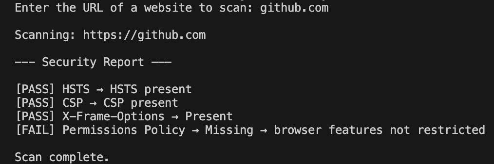

# security-header-scanner
Java tool that analyzes HTTP response headers for common web security misconfigurations.

## Example Output

This shows the tool scanning websites and reporting missing or present security headers.

